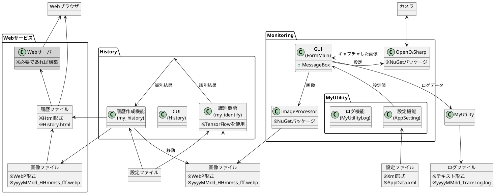
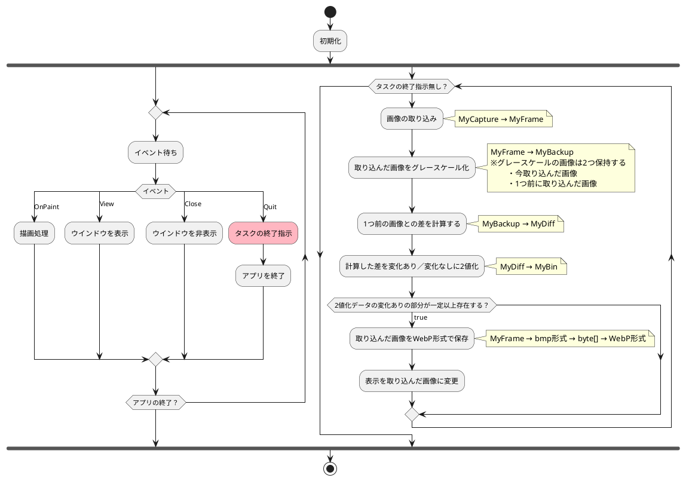
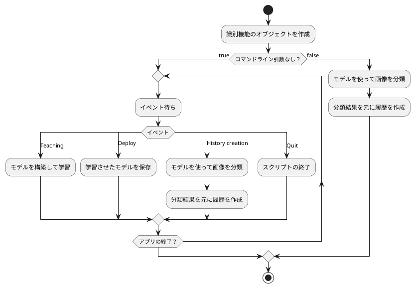

@import "doc.less"

# Monitoring

## 概要設計

### 機能構造＆データフロー



### 設定ファイル(Monitoring)

- 設定値の意味は「CAppSetting」クラスのコメントを参照

```xml
<?xml version="1.0" encoding="utf-8"?>
<CAppSetting>
  <StartupView>false</StartupView>
  <CameraIndex>0</CameraIndex>
  <Width>1280</Width>
  <Height>960</Height>
  <Fps>30</Fps>
  <ExposureCorrection>0</ExposureCorrection>
  <BrightnessCorrection>0</BrightnessCorrection>
  <ContrastCorrection>0</ContrastCorrection>
  <CaptureInterval>1000</CaptureInterval>
  <PercentageDiff>5</PercentageDiff>
  <ImagePath>.\img</ImagePath>
</CAppSetting>
```

### 設定ファイル(History)

```json
{
  "history": {
    "html": "./History.html",
    "keyword": "<!-- OperatingHistoryList -->"
  },
  "model": "MyModel.h5",
  "category": [
    "Operating",
    "Passing",
    "Unmanned"
  ],
  "teaching": [
    {
      "ans": 0,
      "dir": "./img/teaching/0"
    },
    {
      "ans": 1,
      "dir": "./img/teaching/1"
    },
    {
      "ans": 2,
      "dir": "./img/teaching/2"
    }
  ],
  "creation": {
    "dir": "../../Monitoring/bin/Release/img",
    "backup": "./img/backup"
  }
}
```

|設定値|内容|
|-|-|
|history > html|htmlファイルのパス|
|history > keyword|履歴を挿入する位置を特定するキーワード|
|model|ニューラルネットワークのモデルを保存するファイル名|
|category|分類結果に付ける名称|
|teaching > ans|画像の分類番号 ※categoryのインデックス|
|teaching > dir|学習用の画像ファイルが入っているフォルダ|
|creation > dir|Monitoringのキャプチャした画像データが入っているフォルダ|
|creation > backup|creation > dirの中の識別済みの画像ファイルの移動先|

### 履歴ファイル

- 下図のようなイメージ
  - テーブルを用いて日付別に画像一覧を表示

@import "img/history.png"

## 詳細設計(Monitoring)

- .NETのFormアプリ
- C#



## 詳細設計(History)

- Pythonスクリプト



### NNモデル

|項目|内容|
|-|-|
|課題|画像の分類|
|モデル|畳み込みニューラルネッワーク|
|分類|3項目に分類<br>0：人が履歴を残したい操作をしている画像<br>1：人が通過している画像<br>2：人がいない画像|
|扱う画像|1280×960のWebP形式<br>学習の際には60×60のグレースケールに変換|
|my_identifyの出力|A：画像ファイルのパスの配列<br>B：画像の分類結果(categoryの文字列)の配列<br><br>A、Bは同じインデックスで対になっている<br>A[0] の分類は B[0]<br>A[1] の分類は B[1]<br>　：<br>A[n] の分類は B[n]|

<br>

- モデルの性能はイマイチ
  - 教師データの質が悪くて狙い通りの学習ができていないからかと
    - サンプル数が少ない
    - 画像の質が悪い(ピントが合っていいなかったり、暗かったり)
  - 作者の画像処理のスキルが低いので今はこれが精一杯、勉強が必要やね・・・

  @import "img/result.png"